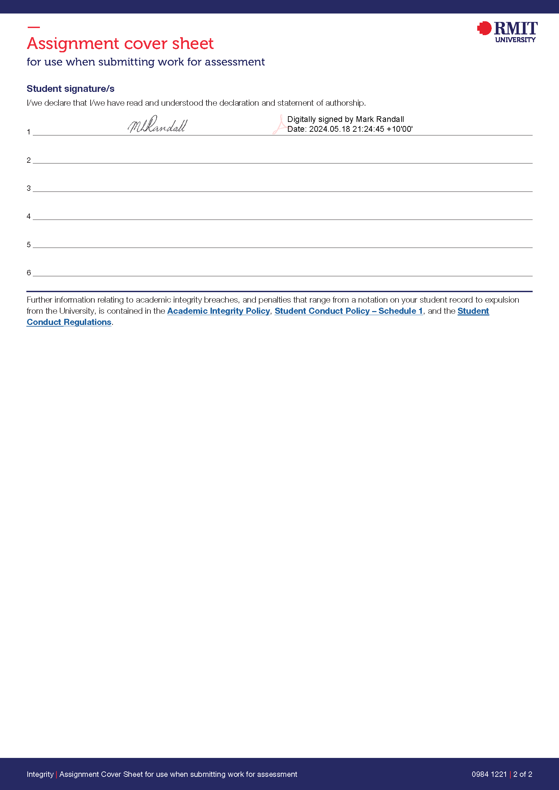

```{r setup, message=FALSE, warning=FALSE, include=FALSE}
library(openxlsx)
library(tidyr)
library(dplyr)
library(readr)
library(readxl)
library(knitr)
library(kableExtra)
library(tidyverse)
library(magrittr)
library(glue)
library(here)
library(tibble)
library(rvest)
library(tidyselect)
library(deductive)
library(deducorrect)
library(validate)
library(Hmisc)
library(stringr)
library(ggplot2)
library(ggnewscale)
library(moments)
library(sn)
library(purrr)
library(sf)
library(maptiles)
library(tidyterra)
library(OpenStreetMap)
# Remove files to await update

loaded_pkg <- c((.packages())) # Get loaded packages
if (file.exists("bibliography.bibtex")) {
  file.remove("bibliography.bibtex")
}
if (file.exists("tmp.bibtex")) {
  file.remove("tmp.bibtex")
}


```

```{r wrap-hook, message=FALSE, warning=FALSE,  echo = FALSE}
# Taken from https://github.com/yihui/knitr-examples/blob/master/077-wrap-output.md
library(knitr)
hook_output = knit_hooks$get('output')
knit_hooks$set(output = function(x, options) {
  # this hook is used only when the linewidth option is not NULL
  if (!is.null(n <- options$linewidth)) {
    x = xfun::split_lines(x)
    # any lines wider than n should be wrapped
    if (any(nchar(x) > n)) x = strwrap(x, width = n)
    x = paste(x, collapse = '\n')
  }
  hook_output(x, options)
})

```

```{r chunk-hook, message=FALSE, warning=FALSE,  echo = FALSE}
#https://stackoverflow.com/questions/74914584/setting-code-chunk-size-on-quarto-pdf-output
default_chunk_hook  <- knitr::knit_hooks$get("chunk")

latex_font_size <- c("Huge", "huge", "LARGE", "Large", 
                     "large", "normalsize", "small", 
                     "footnotesize", "scriptsize", "tiny")

knitr::knit_hooks$set(chunk = function(x, options) {
  x <- default_chunk_hook(x, options)
  if (options$size %in% latex_font_size) {
    paste0("\n \\", options$size, "\n\n", 
      x, 
      "\n\n \\normalsize"
    )
  } else {
    x
  }
})

```

```{r CoverSheet,echo= FALSE, message=FALSE, warning=FALSE, out.width= "50%", out.height = "50%",fig.pos='H'}
  include_graphics("assignment-cover-sheet_Page_1.png")
  
```

## **Student names, numbers and percentage of contributions**
```{r studentNameTable, echo=FALSE}
na<- c(" Mark Randall")
no<- c(" s9001731")
pc<- c("100")

s<- data.frame(cbind(na,no,pc))
colnames(s)<- c("Student name", "Student number", "Percentage of contribution")

s %>% kbl(caption = "Group information") %>%
  kable_styling(latex_options = "HOLD_position")%>%
  kable_classic(full_width = F, html_font = "Cambria")
  
```
\newpage

## **Library Load**

```{r displayPackageRef, echo= FALSE, comments="", results="asis"}

# Code snippet to list all loaded packages and reference them
# Iterate over vector to add a citation key, convert to Bibtex, and store

for (pkg in loaded_pkg) {
  tmp <- citation(pkg, auto = TRUE) # Get citation
  tmp$key <- paste0("R-",pkg) # Add cite key
  tmp_bib <- toBibtex(tmp) # Convert to Bibtex
  write(tmp_bib,file = "tmp.bibtex", append = TRUE, sep = "\n") # Write to file
} # write_bib, and write.bib did not do what I wanted.
#ENDNOTE_FILE <- read.bib("endnote_dw.txt") 
ans_copy_file <- file.copy("endnote_dw.txt","bibliography.bibtex")
ans_App_file <- file.append("bibliography.bibtex","tmp.bibtex")

count <- 1 # Establish package number
# Iterate over package list to add citation notation for R Markdown, and produce Markdown text.
for (pkg in loaded_pkg) {
  cite_text <- paste0(" [@R-",pkg,"]") # Create citation notation
  #Output R markdown 
  cat(paste0("Package ", count," : ", pkg ," ",cite_text,"  ")) # Double space at the end of a line forces \n
  cat("\n") # Not executed in rendering R-Markdown, see above
  count <- count + 1 # Increment package number 
}


```

## **Abstract**

***"Most vehicular accidents in Victoria involve a male driver between 18 to 30 years of Age and a high powered car."*** 

|   This project will use some empirical data collected by the Victorian State Government[@RN94] to examine this statement.  

## **Executive Summary**
|   The Victoria Road Crash Data URL[@RN94] contains nine comma-separated value (csv) and one geo spatial java script object notation (GeoJSON) file. These were downloaded to a Data folder for examination. The files are:

```{r fileList,echo= TRUE,comments="", results="asis", tidy.opts=list(width.cutoff=55,keep.source=FALSE), linewidth= 100 ,size = "scriptsize"}
csvFileNames <- list.files("../../Data",pattern = "*.csv", full.names = TRUE)
fullFileNames <- list.files("../../Data", full.names = TRUE)

for (file in fullFileNames) {
  cat(paste("-\t", file,"\n"))
}
#Create data frames fro csv files
vicRoadsDFList <- sapply(csvFileNames, read.csv)
#Change Key of list to mor HR form
names(vicRoadsDFList) <- c(gsub("../../Data/","", names(vicRoadsDFList)))
```

|   The URL indicates that the metadata was updated 29 April 2024, data observations updated as at 27 November 2024 and that observations temporal start was 1 January 2012.

```{r duplicateACCKEY,echo= TRUE,comments="", results="asis",tidy.opts=list(width.cutoff=55,keep.source=FALSE), linewidth= 100 ,size = "scriptsize"}
posnOfDF <- 1
cat("These files have duplicated accident number keys in the data frame:")
for (tmpDF in vicRoadsDFList) {
  if (n_distinct(tmpDF$ACCIDENT_NO) < dim(tmpDF)[[1]]) {
    cat(paste("-\t",names(vicRoadsDFList)[[posnOfDF]],"\n"))
  }
  posnOfDF <- posnOfDF + 1
}
```

|    This would suggest that the `ACCIDENT_NO` key/attribute is a foreign key in these files.
|    The following is a lst of the attributes/column names by data frame.
```{r dfColNames, echo=TRUE,COMMENT="",fig.pos='H',out.width= "100%",tidy=TRUE, keep.source =FALSE, tidy.opts=list(width.cutoff=55,keep.source=FALSE), linewidth= 100, results ='markup',collapse= TRUE,size = "scriptsize",fig.align="left" }
vecColNamesDF <- list()
posnCN <- 1
for (df in vicRoadsDFList) {
  vecColNamesDF[[names(vicRoadsDFList)[[posnCN]]]] <-  colnames(df)
 
  posnCN <- posnCN + 1
}
#https://stackoverflow.com/questions/60199801/how-to-view-a-list-like-table-style-in-r
max_len <- max(lengths(vecColNamesDF))
df <- purrr::map_df(vecColNamesDF, ~ c(., rep('', max_len - length(.))))
df[,1:5] %>% 
          kable(caption = "Attributes Files 1-4",longtable = TRUE,
                format = "latex", booktabs = TRUE) %>%
          kable_styling(font_size = 5) 
df[,6:9] %>% 
          kable(caption = "Attributes Files 5-9",longtable = TRUE,
                format = "latex", booktabs = TRUE) %>%
          kable_styling(font_size = 5) 
```

|    The following details those tables with common attribute names and what those names are.  
```{r intersectDF, echo=TRUE,COMMENT="",fig.pos='H',out.width= "100%",tidy=TRUE, keep.source =FALSE, tidy.opts=list(width.cutoff=55,keep.source=FALSE), linewidth= 100, results ='asis',collapse= TRUE,size = "scriptsize",fig.align="left" }
namesOfFile <- names(vecColNamesDF)
for (posnOne in 1:length(namesOfFile)) {
  cat(namesOfFile[[posnOne]],"at list no.",posnOne, "intersects with the following file:")
  cat("  \n")
  if (posnOne == length(namesOfFile)) {
    break
  }
  for (posnTwo in (posnOne + 1):length(namesOfFile)) {
   cat("-\t",namesOfFile[[posnTwo]],"at list no.",posnTwo," with these attributes:")
   cat("  \n")
   cat("\t\t-\t",intersect(vecColNamesDF[[posnOne]],vecColNamesDF[[posnTwo]]))
   cat("  \n")
    
    posnTwo <- posnTwo + 1
  }
  cat("  \n")
  posnOne <- posnOne + 1
  
}
```

## **Data**

Provide explanations here.

```{r}

# Import the data, provide your R codes here.


```

<br>
<br>

## **Understand** 


```{r}
# This is the R chunk for the Understand Section

```

Provide explanations here. 

<br>
<br>

##	**Tidy & Manipulate Data I **


```{r}
# This is the R chunk for the Tidy & Manipulate Data I 

```

Provide explanations here. 

<br>
<br>

## **Tidy & Manipulate Data II** 

```{r}
# This is the R chunk for the Tidy & Manipulate Data II 

```

Provide explanations here. 

<br>
<br>

##	**Scan I **

```{r}
# This is the R chunk for the Scan I

```

Provide explanations here. 

<br>
<br>

##	**Scan II**

```{r}
# This is the R chunk for the Scan II

```

Provide explanations here. 


##	**Transform **

```{r}
# This is the R chunk for the Transform Section

```

Provide explanations here. 


\newpage
## **Bibliography**